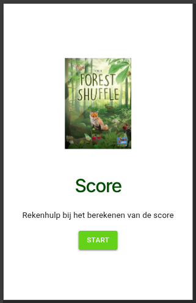
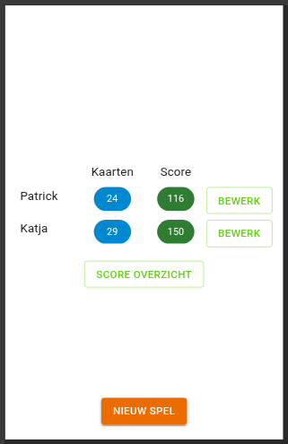
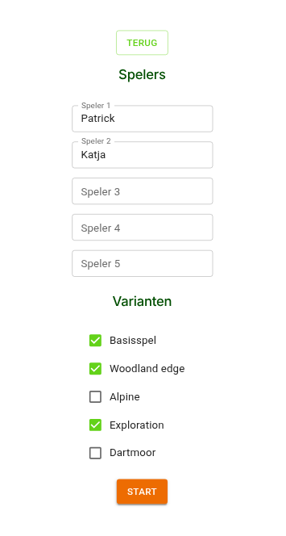
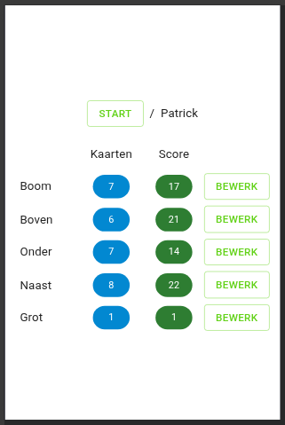
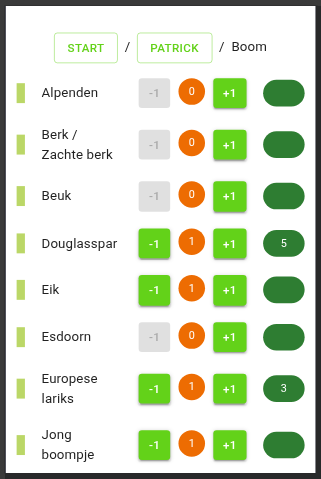
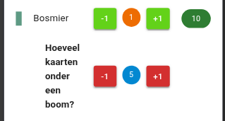
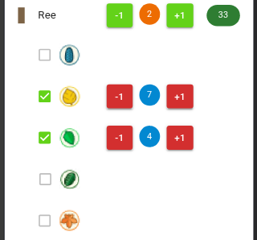
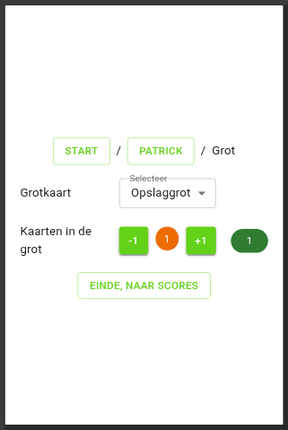
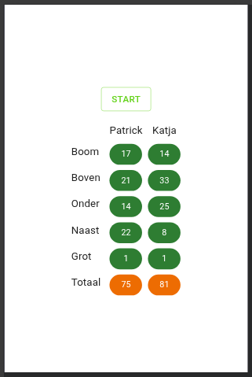

De code voor de mobiele web app (alleen in het nederlands) [Forest Shuffle Score](https://patrickvanbergen.com/forest-shuffle-score/) die helpt bij het berekenen van de score in Forest Shuffle.

## Eerste opmerkingen

- Je voert het aantal kaarten van elk type in, en beantwoord enkele vragen over kaart-aantallen, en de app berekent de score.
- De score kan worden bijgehouden voor het basisspel, en eventueel de varianten Woodland Edge (bosrand), Alpine, en Exploration.
- Standaard begint het spel met de gebruikers Patrick en Katja. Je kunt deze aanpassen bij het begin van een nieuw spel.
- Je input wordt bijgehouden in je browser (local storage).
- De kaart-input wordt gewist aan het begin van elk nieuw spel. Er worden geen historische resultaten bijgehouden.

## Web-app

Je kunt de web-pagina als app installeren op je mobiel, door in het menu van je browser te kiezen voor "Toevoegen aan startscherm" (of vergelijkbaar), en dan "Als app installeren". Je krijgt er dan een icoontje op je startscherm bij.

## Startpagina

De app start op. Druk op Start.

## Gebruikers-overzicht

In het gebruikersoverzicht zie je de actieve gebruikers, met het aantal kaarten dat ze hebben ingevoerd, en hun totale score. Je kunt de namen van de gebruikers aanpassen op de volgende pagina.

Ook kun je hier een nieuw spel beginnen en naar het score-overzicht.

## Nieuw spel

Op deze pagina stel je in met welke personen je speelt en welke varianten je gebruikt. Je hoeft deze alleen in te stellen als ze veranderen.

NB: als je op de knop "Nieuw spel" drukt worden de ingevoerde waarden van het vorige spel verwijderd om een nieuw spel te kunnen beginnen. Als je dat niet wil kun je terug met de knop "Terug".

## Categorie-pagina

Dit is een overzicht van alle kaarten per speler van elke categorie. De grot-kaarten vormen hier een eigen categorie.

Klik op bewerk om de kaart aantallen voor een categorie in te vullen.

## Soorten-pagina

Op de soorten-pagina voer je voor een gebruiker in hoeveel kaarten van elk type hij of zij heeft. Elke pagina bevat alle soorten van een categorie en binnen elke soort zijn de kaarttypen gesorteerd op alfabet, voor de zoekbaarheid.

Druk meermaals op `+1` of `-1` om het juiste aantal kaarten te krijgen. Het getal in het midden (oranje) toont het aantal kaarten en het getal rechts (donkergroen) de score voor dit type kaart.

De score is gebaseerd op de gegevens die het programma tot nu toe heeft van de gebruiker, en wordt **steeds opnieuw bijgewerkt** als er nieuwe aantallen bijkomen. De eik krijgt bijvoorbeeld nog geen punten bij het invoeren van het aantal kaarten, maar pas als de gebruiker 8 verschillende typen boom heeft, krijgt de eik punten.

De score is meestal een geheel getal, maar het kan ook een fractie opleveren. Als een gebruiker bijvoorbeeld 2 verschillende vlinders heeft, leveren die samen 3 punten op. Omdat de punten over de vlinders verdeeld worden, krijgen beide 1.5 punt. Dit wordt genoteerd met `1+`.

Iedere kaart heeft een eigen score-berekening en allemaal worden ze steeds opnieuw berekend bij iedere wijziging aan de aantallen.

Sommige kaarten hebben een subvraag nodig om de score te kunnen berekenen. In dit voorbeeld zie je de Bosmier, die als subvraag wil weten hoeveel kaarten er onder een boom liggen.

Andere kaarten vragen om het aantal kaarten van een boom-kleur. Nadat je het aantal kaarten van Ree hebt opgegeven, kruis je aan welke kleur de reeën hebben en daarna vul je per boom-kleur het aantal kaarten in. Er zijn enkele varianten op dit principe.

## Grot-pagina

Op deze pagina wordt het aantal grot-kaarten ingevoerd, alsook de soort grotkaart (als er met de Exploration uitbreiding gespeeld wordt).

## Score overzicht

Hier zie je de scores per categorie, voor alle gebruikers.

